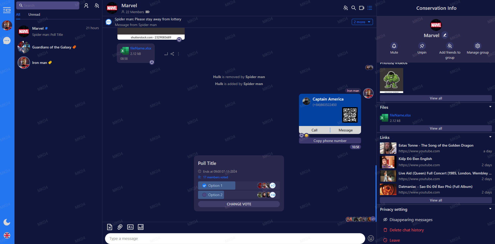

## Table of contents
- [About The Project](#about-the-project)
  - [Screenshot](#screenshot)
  - [Description](#description)
  - [Links](#links)
- [Built with](#built-with)
- [Installation](#installation)
- [Contact](#contact)
- [Acknowledgments](#acknowledgments)
## About The Project
### Screenshot

### Description
A Chat web application (only Front-End) reference from [Zalo](https://zalo.me/pc)
### Links
- Solution URL: https://github.com/mk04-dev/Chat
- Live URL: https://chat-olive-xi.vercel.app
## Built with
- [![React][React.js]][React-url]
- [![TS]][TS-url]
- [![Mobx]][Mobx-url]
- [![I18n]][I18n-url]
## Installation
1. Clone the repo
    ```sh
    git clone https://github.com/mk04-dev/Chat.git
    ```
2. Install NPM packages
    ```sh
    npm install
    ```
3. Disable web security
    - Chrome
      ```sh
      "C:\Program Files (x86)\Google\Chrome\Application\chrome.exe" --disable-web-security --disable-gpu --user-data-dir=%LOCALAPPDATA%\Google\chromeTemp
      ```

    - Microsoft Edge
      ```sh
      "C:\Program Files (x86)\Microsoft\Edge\Application\msedge.exe" --disable-web-security --disable-gpu --user-data-dir="%LOCALAPPDATA%\Microsoft\Edge\User Data\Default"
      ```

## Contact
- Email: tuananhmk04@gmail.com

## Acknowledgments
- [Mustache.js](https://github.com/janl/mustache.js)
- [Font Awesome](https://fontawesome.com)
- [Day.js](https://day.js.org/)
- [Link Preview](https://www.npmjs.com/package/link-preview-js)


[React.js]: https://img.shields.io/badge/React-20232A?style=for-the-badge&logo=react&logoColor=61DAFB
[React-url]: https://reactjs.org/

[Zalo]: https://img.shields.io/badge/Zalo-20232A?style=for-the-badge&logo=zalo&logoColor=61DAFB
[Zalo-url]: https://zalo.me

[Antd]: https://img.shields.io/badge/ant_design-20232A?style=for-the-badge&logo=antdesign&logoColor=0170FE
[Antd-url]: https://ant.design/

[TS]: https://img.shields.io/badge/typescript-20232A?style=for-the-badge&logo=typescript&logoColor=3178C6
[TS-url]: https://www.typescriptlang.org/

[Mobx]: https://img.shields.io/badge/mobx-20232A?style=for-the-badge&logo=mobx&logoColor=FF9955
[Mobx-url]: https://mobx.js.org/

[I18n]: https://img.shields.io/badge/i18next-20232A?style=for-the-badge&logo=i18next&logoColor=26A69A
[I18n-url]: https://github.com/mashpie/i18n-node